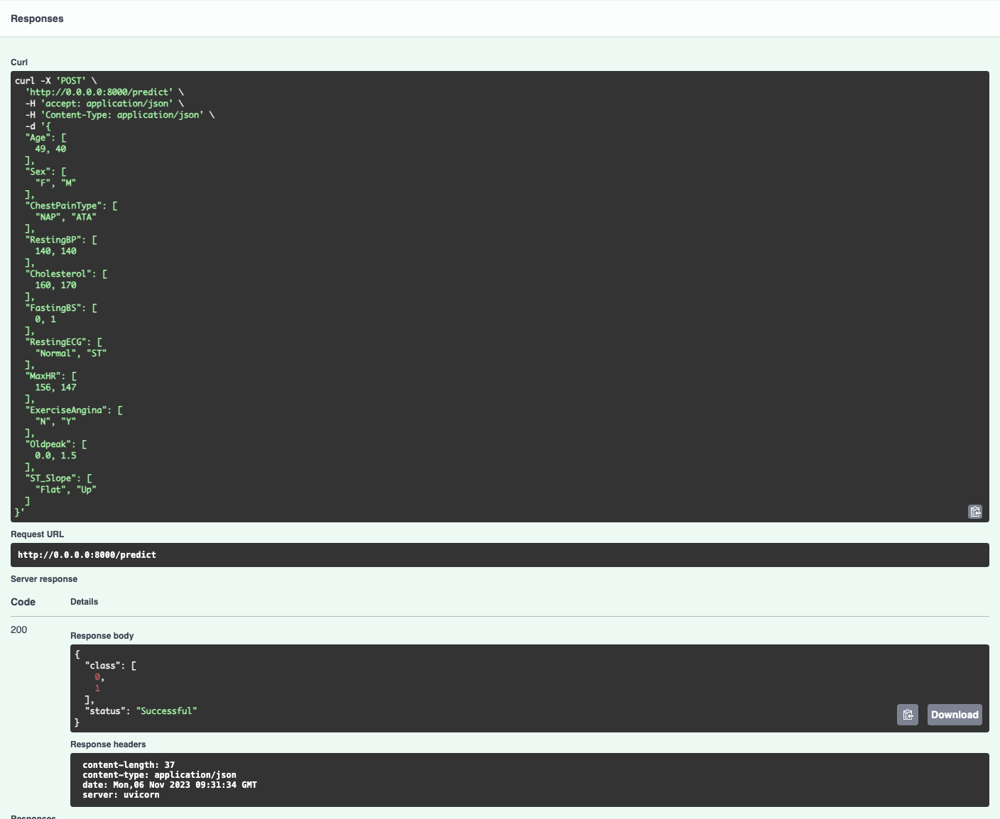

# Heart Disease Classification

## Domain Background
The World Health Organization (WHO) has reported that Cardiovascular diseases (CVDs) stand as the foremost global cause of mortality. In 2019, an estimated 17.9 million individuals succumbed to CVDs, accounting for 32% of all worldwide fatalities. Of these fatalities, 85% were attributed to heart attacks and strokes. Among the 17 million untimely deaths (occurring before the age of 70) resulting from noncommunicable diseases in 2019, 38% were directly linked to CVDs. Heart failure is a common occurrence stemming from CVDs. The utilization of Machine Learning models to predict heart diseases has the potential to significantly mitigate Cardiovascular risk/

## Problem Statement
The data is structured in a tabular format, and the problem is a classification task, specifically a binary classification problem with two classes: **0 (“Normal”)** and **1 (“Heart disease”)**. With a binary classification, there are many potential approaches: Logistic Regression, Random Forest Classifier, LightGBM, ...

In addressing this problem, I employed a variety of algorithms to determine the optimal solution. The key stages I encompassed include data preparation, exploratory data analysis (EDA), feature engineering, model training, evaluation, and ultimately, model deployment.
- Platform:
I utilized AWS SageMaker for various stages of this project, including data preparation, EDA, feature engineering, and model-related tasks, such as training, hyperparameter tuning and evaluation. Subsequently, I deployed the model using two distinct methods. The first entailed leveraging a AWS SageMaker endpoint and AWS Lambda function, while the second involved using the best model's weights and/or hyperparameters for deployment on the FastAPI framework locally.
- Algorithm:
I explored various algorithms using Pycaret. I experimented with hyperparameter tuning using Optuna.

## Environment setup
All experiments were performed on an `ml.m5.xlarge` instance, and the `requirements-sagemaker.txt` file contains a list of all the libraries installed.

If your deployment is local and you are using FastAPI framework:
```pip install -r requirements-local.txt```


## Dataset
This repo used the dataset from [fedesoriano](https://www.kaggle.com/datasets/fedesoriano/heart-failure-prediction)

First five rows of this dataset:


| **Feature**    | **Informatoin**                                                                                                                                                                                                                            |
|----------------|--------------------------------------------------------------------------------------------------------------------------------------------------------------------------------------------------------------------------------------------|
| Age            | age of the patient [years]                                                                                                                                                                                                                 |
| Sex            | sex of the patient [M: Male, F: Female]                                                                                                                                                                                                    |
| ChestPainType  | chest pain type [TA: Typical Angina, ATA: Atypical Angina, NAP: Non-Anginal Pain, ASY: Asymptomatic]                                                                                                                                       |
| RestingBP      | resting blood pressure [mm Hg]                                                                                                                                                                                                             |
| Cholesterol    | serum cholesterol [mm/dl]                                                                                                                                                                                                                  |
| FastingBS      | fasting blood sugar [1: if FastingBS > 120 mg/dl, 0: otherwise]                                                                                                                                                                            |
| RestingECG     | resting electrocardiogram results [Normal: Normal, ST: having ST-T wave abnormality (T wave inversions and/or ST elevation or depression of > 0.05 mV), LVH: showing probable or definite left ventricular hypertrophy by Estes' criteria] |
| MaxHR          | maximum heart rate achieved [Numeric value between 60 and 202]                                                                                                                                                                             |
| ExerciseAngina | exercise-induced angina [Y: Yes, N: No                                                                                                                                                                                                     |
| Oldpeak        | ST [Numeric value measured in depression]                                                                                                                                                                                                  |
| ST_Slope       | the slope of the peak exercise ST segment [Up: upsloping, Flat: flat, Down: downsloping]

## Exploratory data analysis
For more information, please check `explore_data/EDA.ipynb` notebook, which includes detailed interactive plots for more in-depth analysis.

## Benchmark
The benchmark model is a [Logistic Regression](https://www.kaggle.com/code/jiteshmd/logistic-regression-from-scratch) model from Kaggle.
| **Metric** | **Value** |
|------------|-----------|
| Accuracy   | 83.04%    |
| F1-score   | 86.12%    |

The **Logistic Regression** model mentioned earlier intially achieved an accuracy of approximately 55%. However, when attempting to replicate the author's approach, a significantly improved outcome was achieved, with the accuracy rising from approximately 55% to 83.04%. This led to the establishment of a new benchmark.

For more information, please check `baseModel.ipynb` notebook.

## Methodology
- Data preprocessing

I only transformed categorical features into numerical representations using LabelEncoder from Scikit-Learn.

`preprocessing/preprocess_data.py`
```python
def encode_categorical_features(df: pd.DataFrame, categorical_features: List[str]):
    """Label Encode categorical features

    Args:
        df (pd.DataFrame): The dataset.
        categorical_features (List[str]): List of categorical features.
    """
	le = LabelEncoder()
	for feature in categorical_features:
		df[feature] = le.fit_transform(df[feature])
	
	return df


```

- Train/test data splitting

I used Scikit-Learn and utilized a 75% - 25% ratio for the division.
```python
X_train, X_test, y_train, y_test = train_test_split(..., test_size=0.25)
X_y_train = X_train.copy()
X_y_train["HeartDisease"] = y_train
X_y_test = X_test.copy()
X_y_test["HeartDisease"] = y_test


```

- Model comparing

I utilized Pycaret to find the best algorithm. The objective metric is F1-score.
```python
s = setup(data=X_y_train, 
          target='HeartDisease',
          test_data=X_y_test,
          categorical_features=categorical_features,
          preprocess=False,
          session_id=125)
best_models = compare_models(cross_validation=False, sort="F1", n_select=2)


```


- Hyperparameter tuning with Optuna
```
[I 2023-11-05 08:10:15,995] A new study created in memory with name: no-name-e4597de1-7db0-4ce2-be05-334990cd1b0e
[I 2023-11-05 08:10:16,128] Trial 0 finished with value: 0.8904593639575971 and parameters: {'n_estimators': 107, 'max_depth': 11, 'max_leaf_nodes': 21, 'criterion': 'entropy'}. Best is trial 0 with value: 0.8904593639575971.
[I 2023-11-05 08:10:16,222] Trial 1 finished with value: 0.8833922261484098 and parameters: {'n_estimators': 79, 'max_depth': 16, 'max_leaf_nodes': 22, 'criterion': 'entropy'}. Best is trial 0 with value: 0.8904593639575971.
[I 2023-11-05 08:10:16,328] Trial 2 finished with value: 0.881118881118881 and parameters: {'n_estimators': 90, 'max_depth': 16, 'max_leaf_nodes': 24, 'criterion': 'gini'}. Best is trial 0 with value: 0.8904593639575971.
[I 2023-11-05 08:10:16,416] Trial 3 finished with value: 0.8825622775800711 and parameters: {'n_estimators': 74, 'max_depth': 15, 'max_leaf_nodes': 21, 'criterion': 'entropy'}. Best is trial 0 with value: 0.8904593639575971.
[I 2023-11-05 08:10:16,483] Trial 4 finished with value: 0.8741258741258742 and parameters: {'n_estimators': 51, 'max_depth': 13, 'max_leaf_nodes': 16, 'criterion': 'entropy'}. Best is trial 0 with value: 0.8904593639575971.
[I 2023-11-05 08:10:16,589] Trial 5 finished with value: 0.8833922261484098 and parameters: {'n_estimators': 90, 'max_depth': 10, 'max_leaf_nodes': 20, 'criterion': 'entropy'}. Best is trial 0 with value: 0.8904593639575971.
[I 2023-11-05 08:10:16,706] Trial 6 finished with value: 0.8842105263157894 and parameters: {'n_estimators': 103, 'max_depth': 12, 'max_leaf_nodes': 16, 'criterion': 'gini'}. Best is trial 0 with value: 0.8904593639575971.
[I 2023-11-05 08:10:16,791] Trial 7 finished with value: 0.8732394366197183 and parameters: {'n_estimators': 74, 'max_depth': 11, 'max_leaf_nodes': 10, 'criterion': 'gini'}. Best is trial 0 with value: 0.8904593639575971.
[I 2023-11-05 08:10:16,899] Trial 8 finished with value: 0.881118881118881 and parameters: {'n_estimators': 94, 'max_depth': 12, 'max_leaf_nodes': 21, 'criterion': 'gini'}. Best is trial 0 with value: 0.8904593639575971.
[I 2023-11-05 08:10:17,034] Trial 9 finished with value: 0.8842105263157894 and parameters: {'n_estimators': 116, 'max_depth': 11, 'max_leaf_nodes': 18, 'criterion': 'entropy'}. Best is trial 0 with value: 0.8904593639575971.
[I 2023-11-05 08:10:17,181] Trial 10 finished with value: 0.8842105263157894 and parameters: {'n_estimators': 116, 'max_depth': 14, 'max_leaf_nodes': 13, 'criterion': 'entropy'}. Best is trial 0 with value: 0.8904593639575971.
[I 2023-11-05 08:10:17,316] Trial 11 finished with value: 0.8842105263157894 and parameters: {'n_estimators': 105, 'max_depth': 12, 'max_leaf_nodes': 16, 'criterion': 'gini'}. Best is trial 0 with value: 0.8904593639575971.
[I 2023-11-05 08:10:17,495] Trial 12 finished with value: 0.881118881118881 and parameters: {'n_estimators': 104, 'max_depth': 10, 'max_leaf_nodes': 14, 'criterion': 'gini'}. Best is trial 0 with value: 0.8904593639575971.
[I 2023-11-05 08:10:17,714] Trial 13 finished with value: 0.881118881118881 and parameters: {'n_estimators': 103, 'max_depth': 12, 'max_leaf_nodes': 18, 'criterion': 'gini'}. Best is trial 0 with value: 0.8904593639575971.
[I 2023-11-05 08:10:17,970] Trial 14 finished with value: 0.8904593639575971 and parameters: {'n_estimators': 119, 'max_depth': 13, 'max_leaf_nodes': 25, 'criterion': 'entropy'}. Best is trial 0 with value: 0.8904593639575971.
[I 2023-11-05 08:10:18,256] Trial 15 finished with value: 0.8904593639575971 and parameters: {'n_estimators': 120, 'max_depth': 14, 'max_leaf_nodes': 25, 'criterion': 'entropy'}. Best is trial 0 with value: 0.8904593639575971.
[I 2023-11-05 08:10:18,501] Trial 16 finished with value: 0.8873239436619719 and parameters: {'n_estimators': 110, 'max_depth': 13, 'max_leaf_nodes': 23, 'criterion': 'entropy'}. Best is trial 0 with value: 0.8904593639575971.
[I 2023-11-05 08:10:18,637] Trial 17 finished with value: 0.880281690140845 and parameters: {'n_estimators': 54, 'max_depth': 14, 'max_leaf_nodes': 25, 'criterion': 'entropy'}. Best is trial 0 with value: 0.8904593639575971.
[I 2023-11-05 08:10:18,844] Trial 18 finished with value: 0.8754448398576513 and parameters: {'n_estimators': 96, 'max_depth': 11, 'max_leaf_nodes': 20, 'criterion': 'entropy'}. Best is trial 0 with value: 0.8904593639575971.
[I 2023-11-05 08:10:19,064] Trial 19 finished with value: 0.8873239436619719 and parameters: {'n_estimators': 111, 'max_depth': 13, 'max_leaf_nodes': 24, 'criterion': 'entropy'}. Best is trial 0 with value: 0.8904593639575971


```


- Feature engineering

I used Random Forest Classifier to asses the importance of individual features.

`feature_engineering/feature_importance.py`
```python
def plot_feature_importance(X_train, y_train, 
                            hyperparameters={
                                "n_estimators": 100,
                                "random_state": 42
                            }
                           ):
    """Plot feature importance figure from Random Forest Classifier
    Args:
        X_train, y_train: train set
        hyperparameters: hyperparameters of Random Forest Classifier. 
                         Defaults: {"n_estimators": 100, "random_state": 42}
    """
    
    rf = RandomForestClassifier(**hyperparameters)
    rf.fit(X_train, y_train)
    pi = permutation_importance(
        rf, 
        X_train, 
        y_train, 
        n_repeats=10,
        random_state=42)
    
    pi_sorted_idx = pi.importances_mean.argsort()
    tree_importance_sorted_idx = np.argsort(rf.feature_importances_)
    tree_idx = np.arange(0, len(rf.feature_importances_)) + 0.5

    # Create subplot
    fig, (ax1, ax2) = plt.subplots(1, 2, figsize=(12, 8))
    
    ax1.barh(tree_idx,
             rf.feature_importances_[tree_importance_sorted_idx], height=0.7)
    ax1.set_yticklabels(X_train.columns[tree_importance_sorted_idx])
    ax1.set_yticks(tree_idx)
    ax1.set_ylim((0, len(rf.feature_importances_)))
    ax2.boxplot(pi.importances[pi_sorted_idx].T, 
                vert=False,
                labels=X_train.columns[pi_sorted_idx])
    
    fig.tight_layout()
    plt.show()
	
```


- Deploy with AWS Endpoint and AWS Lambda function

*1. Train a classifier using `sagemaker.sklearn.estimator`*
```python
bucket = "heart-disease-capstone-project"
os.environ['SM_CHANNEL_TRAINING'] = f"s3://{bucket}/"
os.environ['SM_MODEL_DIR'] = f"s3://{bucket}/model/"

estimator = SKLearn(source_dir="src",
                    entry_point="train.py",
                    output_path=f"s3://{bucket}",
                    base_job_name="heart-disease-classification",
                    role=role,
                    framework_version="1.2-1",
                    instance_count=1,
                    instance_type="ml.m5.large"
                   )
estimator.fit({"training": f"s3://{bucket}/dataset"})


```

*2. Deploy this classifer to AWS Endpoint using `sagemaker.sklearn.model.SKLearnMode`, `sagemaker.sklearn.model.SKLearnPredictor`*
```python
model_location = estimator.model_data
json_serializer = sagemaker.serializers.JSONSerializer()
json_deserializer = sagemaker.deserializers.JSONDeserializer()
class Predictor(SKLearnPredictor):
    def __init__(self, endpoint_name, sagemaker_session):
        super(Predictor, self).__init__(
            endpoint_name,
            sagemaker_session=sagemaker_session,
            serializer=json_serializer,
            deserializer=json_deserializer,
        )
        
sklearn_model = SKLearnModel(
    model_data=model_location,
    source_dir="src",
    role=role,
    entry_point="inference.py",
    framework_version="1.2-1",
    predictor_cls=Predictor
)
predictor = sklearn_model.deploy(initial_instance_count=1, instance_type="ml.m5.large")

```

Test


*3. Deploy to AWS Lambda function*

Create `lambda_function.py`
```python
import json
import boto3

endpoint_Name = "sagemaker-scikit-learn-2023-11-06-02-14-14-585"
# endpoint_Name is the name of the endpoint deployed at step 2.
runtime = boto3.Session().client("sagemaker-runtime")

def lambda_handler(event, context):
    print('Context: ', context)
    print('EventType: ', type(event))
    
    response = runtime.invoke_endpoint(
        EndpointName=endpoint_Name,
        ContentType="application/json",
        Accept="application/json",
        Body=json.dumps(event)
    )
    
    result = response["Body"].read().decode('utf-8')
    sss = json.loads(result)
    
    return {
        'statusCode': 200,
        'headers' : {'Content-Type' : 'text/plain', 'Access-Control-Allow-Origin' : '*'},
        'type-result' : str(type(result)),
        'COntent-Type-In' : str(context),
        'body' : json.dumps(sss)
    }

	
```

Make sure to attach the SageMaker access permission policy to the Lambda function.
- Deploy locally with FastAPI

To run the API, execute the command `python deploy/FastAPI/app.py`. The API will be accessible at `localhost:8000`.
Result:



For more information, please check `main.ipynb` notebook.

## Conclusion
An extra tree classifier exceeded the performance of the benchmark model and was successfully deployed using two methods: AWS Lambda functions and the FastAPI framework. While the problem was adequately addressed, it is imperative that additional assessments be conducted before deployment in a production environment.