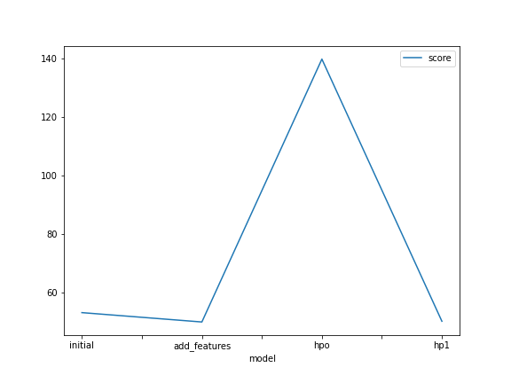
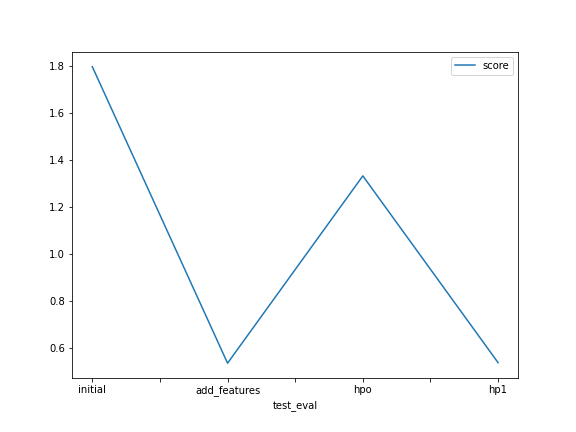

# Report: Predict Bike Sharing Demand with AutoGluon Solution
#### To Duc Thanh

## Initial Training
### What did you realize when you tried to submit your predictions? What changes were needed to the output of the predictor to submit your results?
My first submission got value of 1.79756, which is quite bad at Kaggle leaderboard. I thought more work to do to improve this score. One thing that this competition required was the predictions could not be negative, so every negative values must be set to 0.

### What was the top ranked model that performed?
The top ranked model used default hyperparameters, removed a feature, added some features and converted data type. Its score was 0.53666 RMSE with Weighted Ensemble method.

## Exploratory data analysis and feature creation :mag_right:
### What did the exploratory analysis find and how did you add additional features?
EDA found some features needed type conversion (from numeric type to category type) and datetime feature should be parsed and splitted into month, day and hour feature. The model that removed original datetime column also had better result.

### How much better did your model preform after adding additional features and why do you think that is?
After modifying features, the model performed significantly better, decrease from 1.79756 to 0.53666 RMSE. Extracting datetime feature to simpler forms provides model helpful information about the time bikes used. Then, it was removing datetime column after converting to month, day and hour that eliminates unneccessary information like minute and second.
Converting features like working, holiday to their true nature as categorical values also contributed to good performance.

## Hyper parameter tuning
### How much better did your model preform after trying different hyper parameters?
I tuned twice, the first time the result was worse with the score of 1.33307 and the second did not improve neither with the score of 0.53860.

### If you were given more time with this dataset, where do you think you would spend more time?
I would do more research to understand each algorithm and its hyperparamter properly, instead of tunning randomly.

### Create a table with the models you ran, the hyperparameters modified, and the kaggle score.
|model            |time limit     |hyperparameters                                      |score     |
|-----------------|---------------|-----------------------------------------------------|----------|
|initial          |600            |default                                              |1.79756   |
|add_features     |600            |default                                              |0.53666   |
|hpo              |600            |presets: bayesopt                                    |1.33307   |
|hp1              |400            |GBM: {feature_selection: 0.8}, XGB: {max_depth: 3}   |0.53860   | 

### Create a line plot showing the top model score for the three (or more) training runs during the project.

### Create a line plot showing the top kaggle score for the three (or more) prediction submissions during the project.

## Summary
The top ranked model used default hyperparameters with the score of 0.53666 RMSE. Weighted Ensemble model was best method in all cases.
