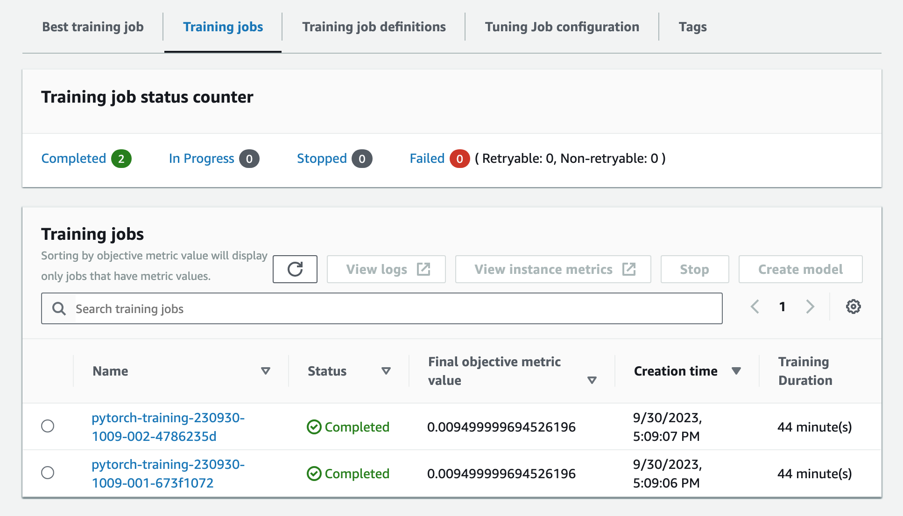
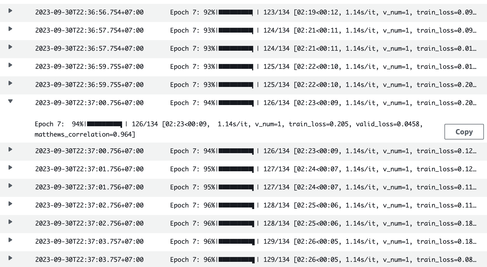
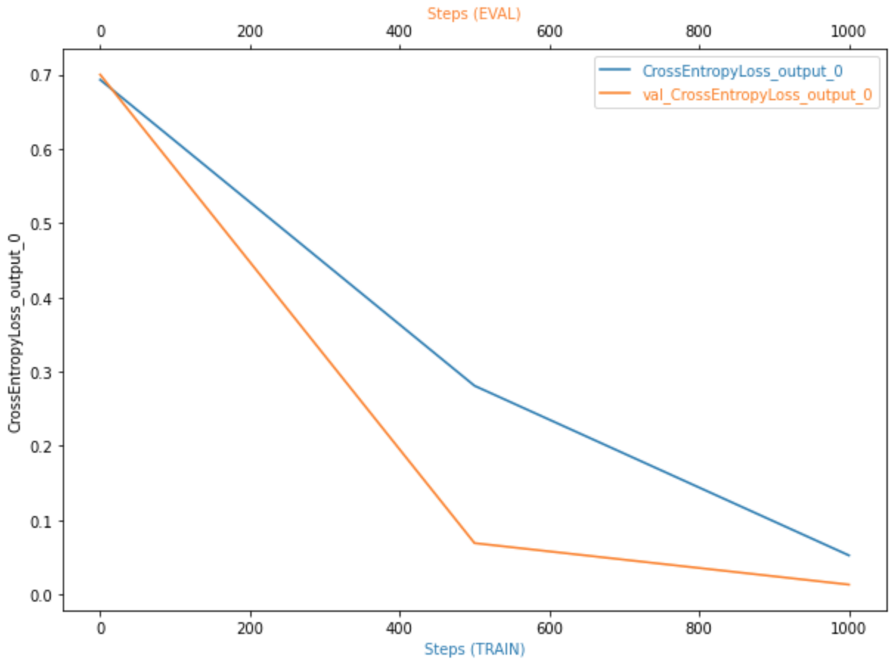
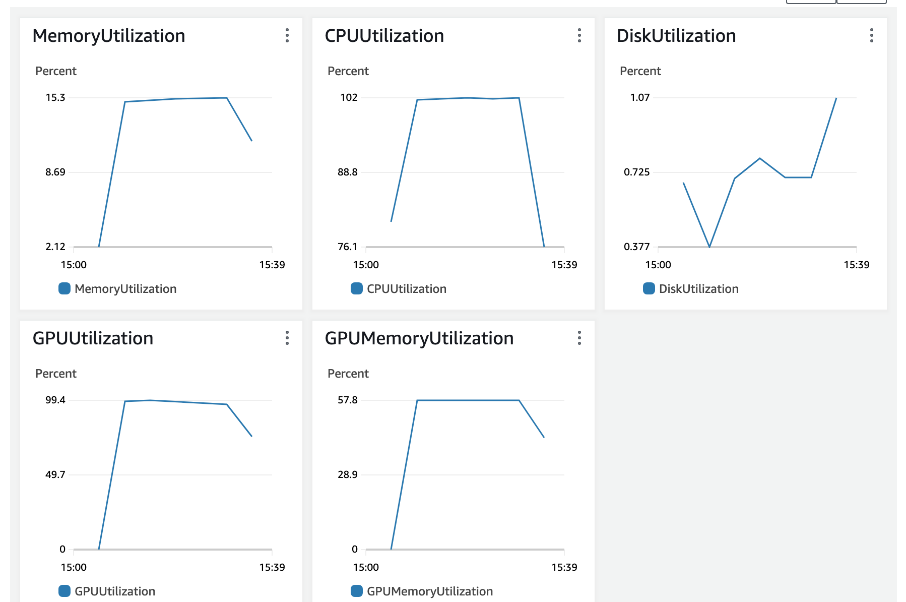

# Text Classification using AWS SageMaker and Pytorch Lightning

This repository focuses on utilizing AWS SageMaker and PyTorch Lightning to address a text classification problem. The choice of a simple model expedites the hyperparameter tuning experiments. The PyTorch Lightning framework serves as the project's cornerstone, offering an efficient and robust workflow for building and training Deep Learning models. I employed SageMaker Debugger, Profiling, and various Machine Learning Engineering practices to enhance productivity throughout the entire process.

## Project setup
There are two main folders: `src` and `notebooks`. `src` contains python scripts to run SageMaker script mode, along with essential helper files and environment requirements. `notebooks` includes Jupyter Notebooks to run in AWS SageMaker Studio.

```
│
├── src
│   ├── requirements.txt
│   ├── model_hpo.py
│   ├── core.py
│   ├── net.py
│   ├── ...
│   ├── ...
├── notebooks
│   ├── download_and_upload_data_to_S3.ipynb
│   ├── explore_data.ipynb
│   ├── base_model_experiment.ipynb
│   ├── ...
│   ├── ...
│
```

## Dataset
The dataset I chose is **CoLA (Corpus of Linguistic Acceptability)** dataset, which is from **GLUE (General Language Understanding Evaluation)** benchmark. The GLUE benchmark is a collection of natural language understanding tasks that are commonly used to evaluate the performance of various NLP models. This dataset is designed to assess the ability of NLP models to determine the grammatical correctness or acceptability of sentences in English. It consists of sentences that are labeled as either "grammatical" or "ungrammatical." The task involves *binary classification*, where the goal is to classify each sentence as grammatically correct or not. In this [notebook](notebooks/download_and_upload_data_to_S3.ipynb) :notebook:, I downloaded CoLA from Hugging Face Datasets library and uploaded to S3.
Let's explore this dataset &rarr; [Explore](notebooks/explore_data.ipynb) :mag_right:

## Base model
My idea is to use a simple and familiar architecture to attack this task. I chose **distill-bert-uncased** tokenizer and classification model from Hugging Face library:
```python
from transformers import AutoTokenizer, AutoModelForSequenceClassification

name = "distilbert-base-uncased"
tokenizer = AutoTokenizer.from_pretrained(name)
model = AutoModelForSequenceClassification.from_pretrained(name, num_labels=2)

```
Step-by-step to build and train base model: [Base-model](docs/base-model-experiment.md) :books:

## Hyperparmeter tuning
I tuned three hyperparameters:
```python
hyperparameter_ranges = {
    "lr": ContinuousParameter(2e-5, 2e-4),
    "batch-size": CategoricalParameter([16, 32, 64]),
    "max-length": CategoricalParameter([128, 256])
}
```
`Max length` is a hyperparameter of the tokenizer:
```python
def tokenize_sentence(self, batch):
	outputs = self.tokenizer(
				batch["sentence"],
				max_length=256,   # Here    
				truncation=True,
				padding="max_length",
				return_tensors="pt"
				)

	return outputs
```
Initially, I intended to tune 4 jobs; however, the process has consumed a significant amount of time and utilized GPU resources, resulting in substantial costs. I decided to tune only 2 jobs. The [hyperparameter_tuning.ipynb](notebooks/hyperparameter_tuning.ipynb) notebook used [model_hpo.py](src/model_hpo.py) script. The objective metric is Average Validation Loss.



Because there are only 2 jobs, the result does not improve much. The optimal values are:
* Batch size: 64
* Learning rate: 0.00015571726483079338
* Max Length: 256

## Debuging and Profiling
I trained the model with the best hyperparamters above. This is all hyperparamters used:
```python
"epochs": 8
"batch-size": 64
"lr": 0.00015571726483079338
"eps": 1e-8
"max-length": 256
"num-workes": 0
```
The [debug_and_profile.ipynb](notebooks/debug_and_profile.ipynb) notebook used multiple rules for debugger and profiller:
```python
rules = [
    Rule.sagemaker(rule_configs.loss_not_decreasing()),
    ProfilerRule.sagemaker(rule_configs.LowGPUUtilization()),
    ProfilerRule.sagemaker(rule_configs.ProfilerReport()),
    Rule.sagemaker(rule_configs.vanishing_gradient()),
    Rule.sagemaker(rule_configs.overfit()),
    Rule.sagemaker(rule_configs.overtraining()),
    Rule.sagemaker(rule_configs.poor_weight_initialization()),
]
profiler_config = ProfilerConfig(
    system_monitor_interval_millis=500, framework_profile_params=FrameworkProfile(num_steps=10)
)
debugger_config = DebuggerHookConfig(
    hook_parameters={"train.save_interval": "100", "eval.save_interval": "10"}
)
```
The scipt for this notebook: [train_model.py](src/train_model.py)
### Result





SageMaker also generated the Profiler Report in HTML format: [Report](docs/profile-report.html) :page_facing_up:

## Model Deployment
We need to create an [inference.py](src/inference.py) script for deployment step. The [train_and_deploy.ipynb](notebooks/train_and_deploy.ipynb) notebook used this script to deploy an endpoint. For this endpoint, I employed the **ml.g4dn.xlarge** instance to leverage GPU capabilities.
