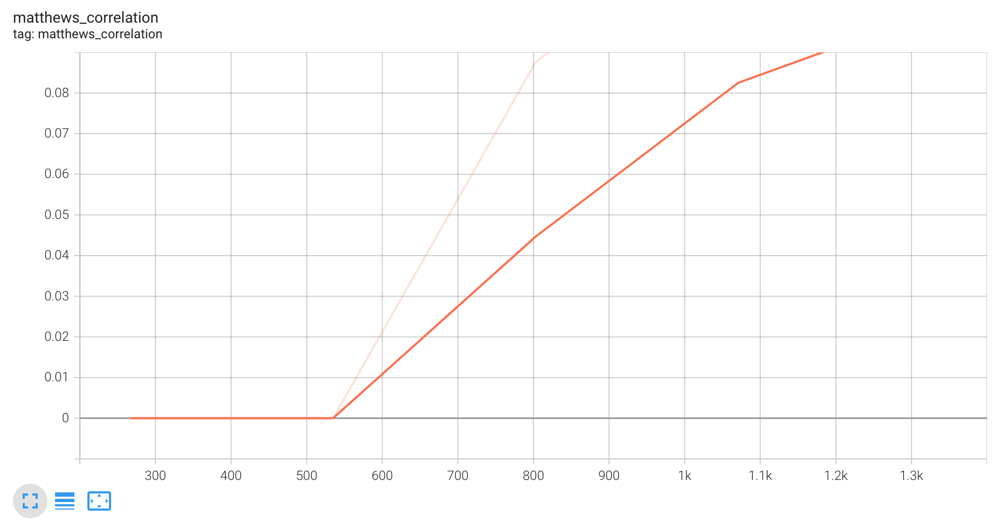

# Base model
The core model:
```python
class GrammarModel(pl.LightningModule):
    def __init__(self, lr=2e-5, eps=1e-8, batch_size=32):
        super().__init__()
        self.save_hyperparameters()
        self.lr = lr
        self.eps = eps
        self.batch_size = batch_size
        self.num_classes = 2
        self.model = AutoModelForSequenceClassification.from_pretrained(
            "distilbert-base-uncased", num_labels=self.num_classes
        )
        self.tokenizer = AutoTokenizer.from_pretrained("distilbert-base-uncased")

        self.metric = load_metric("glue", "cola")
        self.criterion = nn.CrossEntropyLoss()
        
        self.predictions = []
        self.references = []

    def prepare_data(self):
        cola_dataset = load_dataset("glue", "cola")
        self.train_data = cola_dataset["train"]
        self.val_data = cola_dataset["validation"]
        
        self.train_data = self.train_data.map(self.tokenize_sentence, batched=True)
        self.val_data = self.val_data.map(self.tokenize_sentence, batched=True)
        
        self.train_data.set_format(
                type="torch", columns=["input_ids", "attention_mask", "label"]
            )
        self.val_data.set_format(
                type="torch", columns=["input_ids", "attention_mask", "label"]
            )

    def tokenize_sentence(self, batch):
        outputs = self.tokenizer(
                    batch["sentence"],
                    max_length=128,
                    truncation=True,
                    padding="max_length",
                    )
        
        return outputs

    def forward(self, batch):
        input_ids, attention_mask = batch["input_ids"], batch["attention_mask"]
        outputs = self.model(input_ids, attention_mask=attention_mask)
        logits = outputs.logits
        
        return logits

    def train_dataloader(self):
        return torch.utils.data.DataLoader(
            self.train_data, batch_size=self.batch_size, shuffle=True
        )

    def val_dataloader(self):
        return torch.utils.data.DataLoader(
            self.val_data, batch_size=self.batch_size, shuffle=False
        )

    def training_step(self, batch, batch_idx):
        labels = batch["label"]
        logits = self.forward(batch)
        loss = self.criterion(logits.view(-1, self.num_classes), labels)
        
        self.log("train_loss", loss, prog_bar=True)
        
        return loss

    def validation_step(self, batch, batch_idx):
        labels = batch["label"]
        logits = self.forward(batch)
        loss = self.criterion(logits.view(-1, self.num_classes), labels)
        preds = torch.argmax(logits, dim=1)
        
        self.log("valid_loss", loss, prog_bar=True)
        self.predictions.append(preds)
        self.references.append(labels)

    def on_validation_epoch_end(self):
        predictions = torch.concat(self.predictions).view(-1)
        references = torch.concat(self.references).view(-1)
        matthews_correlation = self.metric.compute(
            predictions=predictions, references=references
        )
        
        self.log_dict(matthews_correlation, sync_dist=True, prog_bar=True)
        self.predictions.clear()
        self.references.clear()

    def configure_optimizers(self):
        return torch.optim.AdamW(self.parameters(), lr=self.lr, eps=self.eps)
	
```




[Notebook](../notebooks/base_model_experiment.ipynb)
More about Matthews Correlation Coefficient: [MCC](https://encyclopedia.pub/entry/35211)