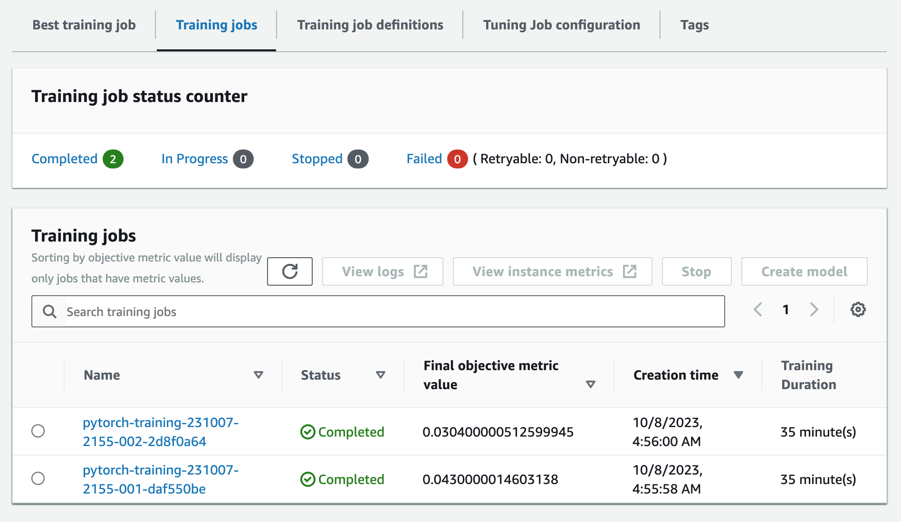
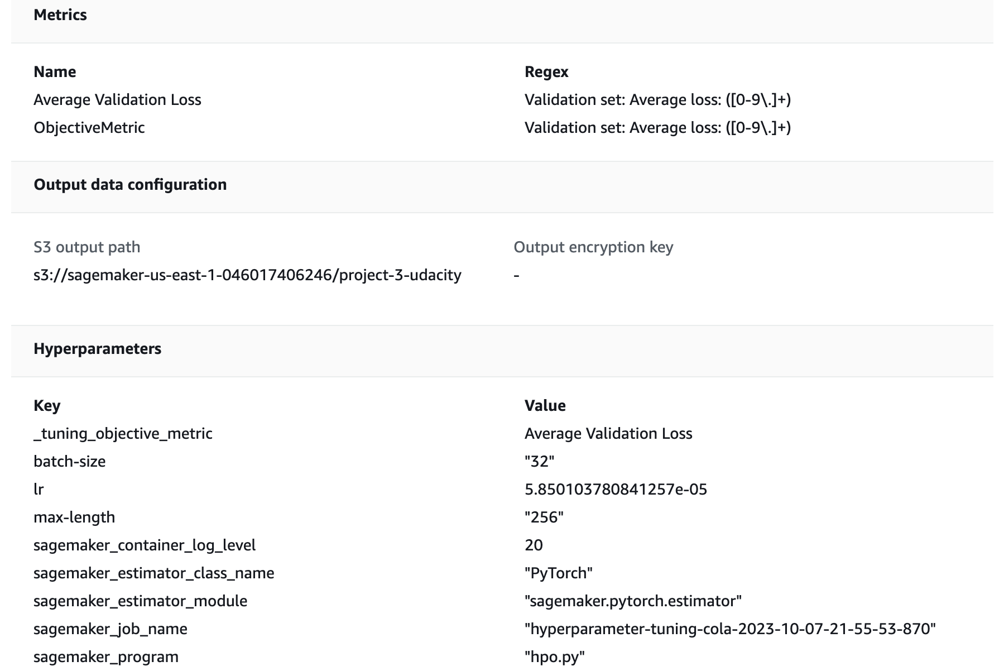
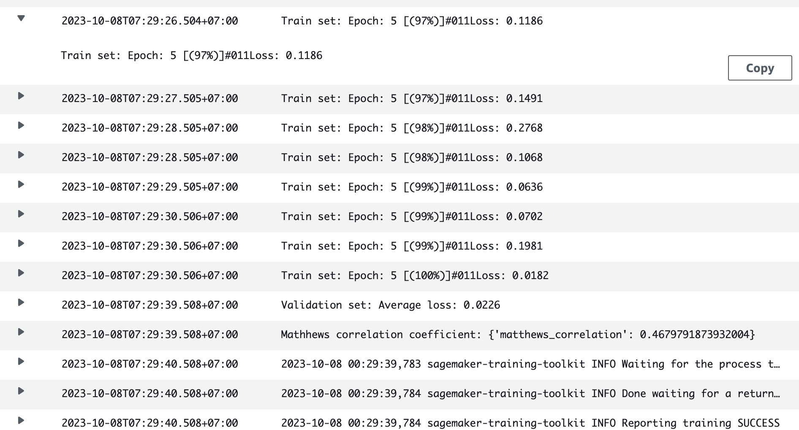
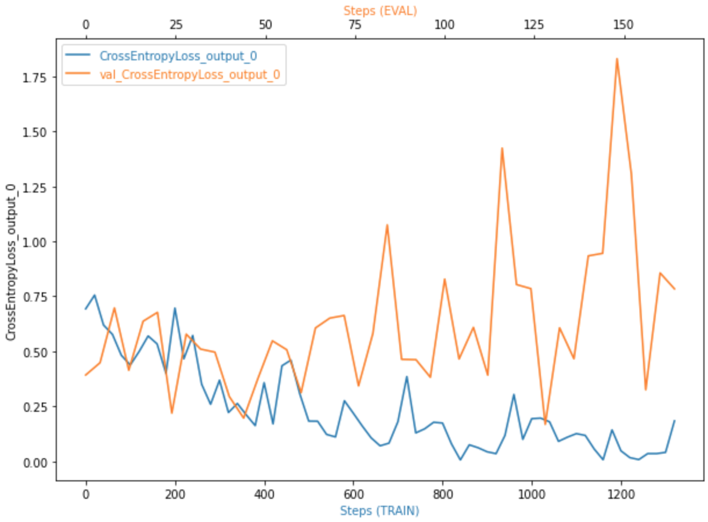
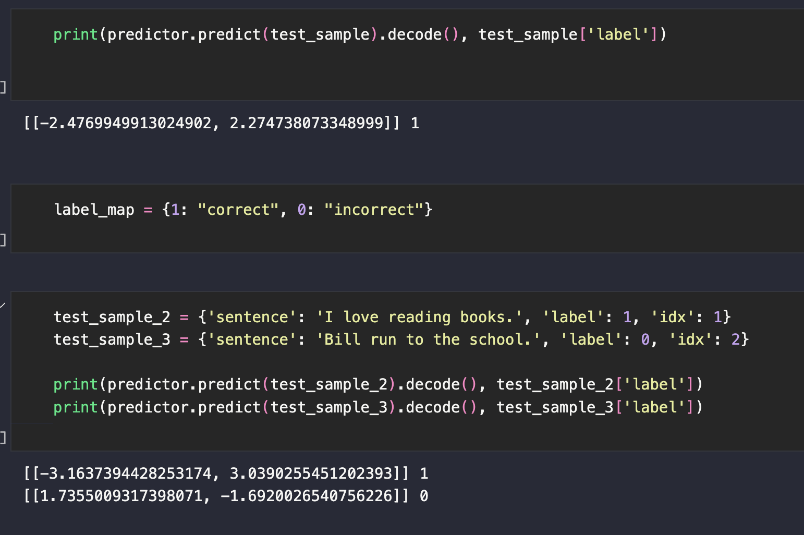

# Text Classification using AWS SageMaker

This repository focuses on utilizing AWS SageMaker to address a text classification problem. The choice of a simple model expedites the hyperparameter tuning experiments. I employed SageMaker Debugger, Profiling, and various Machine Learning Engineering practices to enhance productivity throughout the entire process.

## Dataset
The dataset I chose is **CoLA (Corpus of Linguistic Acceptability)** dataset, which is from **GLUE (General Language Understanding Evaluation)** benchmark. The GLUE benchmark is a collection of natural language understanding tasks that are commonly used to evaluate the performance of various NLP models. This dataset is designed to assess the ability of NLP models to determine the grammatical correctness or acceptability of sentences in English. It consists of sentences that are labeled as either "grammatical" or "ungrammatical." The task involves *binary classification*, where the goal is to classify each sentence as grammatically correct or not. The dataset can be loaded from datasets library.

```python
from datasets import load_dataset

cola_dataset = load_dataset("glue", "cola")
cola_dataset.save_to_disk("./dataset")
```
### Access
```python
import sagemaker

sess = sagemaker.Session()
bucket = sess.default_bucket()
prefix = "project-3-udacity/dataset"
upload_data = sess.upload_data(path='dataset', key_prefix=prefix)
```
## Base model
My idea is to use a simple and familiar architecture to attack this task. I chose **distill-bert-uncased** tokenizer and classification model from Hugging Face library:
```python
from transformers import AutoTokenizer, AutoModelForSequenceClassification

name = "distilbert-base-uncased"
tokenizer = AutoTokenizer.from_pretrained(name)
model = AutoModelForSequenceClassification.from_pretrained(name, num_labels=2)

```

## Hyperparmeter tuning
I tuned three hyperparameters:
```python
hyperparameter_ranges = {
    "lr": ContinuousParameter(2e-5, 2e-4),
    "batch-size": CategoricalParameter([32, 64]),
    "max-length": CategoricalParameter([128, 256])
}

objective_metric_name = "Average Validation Loss"
objective_type = "Minimize"
metric_definitions = [{"Name": "Average Validation Loss", "Regex": "Validation set: Average loss: ([0-9\\.]+)"}]
```
`Learning rate` with a range of 2e-5 to 2e-4 and type of continuous (ContinuousParameter)
`Batch size` with a range of 32, 64 and type of categorical (CategoricalParameter)
`Max length` with a range of 128, 256 is and a hyperparameter of the tokenizer:
```python
def tokenize_sentence(self, batch):
	outputs = self.tokenizer(
				batch["sentence"],
				max_length=256,   # Here    
				truncation=True,
				padding="max_length",
				return_tensors="pt"
				)

	return outputs
```
Initially, I intended to tune 4 jobs; however, the process has consumed a significant amount of time and utilized GPU resources, resulting in substantial costs. I decided to tune only 2 jobs. 

The optimal values are:
* Batch size: 32
* Learning rate: 5.850103780841257e-05
* Max Length: 256

The notebook `train_and_deploy.ipynb` used script [hpo.py](src/hpo.py) for tuning jobs.

## Debuging and Profiling
I trained the model with the best hyperparamters above. This is all hyperparamters used:
```python
"epochs": 5
"batch-size": 32
"lr": 5.850103780841257e-05
"eps": 1e-8
"max-length": 256
```
There are multiple rules for debugger and profiller:
```python
rules = [
    Rule.sagemaker(rule_configs.loss_not_decreasing()),
    ProfilerRule.sagemaker(rule_configs.LowGPUUtilization()),
    ProfilerRule.sagemaker(rule_configs.ProfilerReport()),
    Rule.sagemaker(rule_configs.vanishing_gradient()),
    Rule.sagemaker(rule_configs.overfit()),
    Rule.sagemaker(rule_configs.overtraining()),
    Rule.sagemaker(rule_configs.poor_weight_initialization()),
]

profiler_config = ProfilerConfig(
    system_monitor_interval_millis=500, framework_profile_params=FrameworkProfile(num_steps=10)
)

collection_config_list = [
    CollectionConfig(
        name="CrossEntropyLoss_output_0",
        parameters={
            "include_regex": "CrossEntropyLoss_output_0", 
            "train.save_interval": "20",
            "eval.save_interval": "4"
        }
    )
]

debugger_config = DebuggerHookConfig(
    hook_parameters={"train.save_interval": "100", "eval.save_interval": "10"},
    collection_configs=collection_config_list
)
```
The notebook `train_and_deploy.ipynb` used script [train_model.py](src/train_model.py) for model training, debuging and profiling.
### Result


The training loss decreased and the validation loss had the tendency to increase. The model is overfit!

SageMaker also generated the Profiler Report in HTML format: [Report](/profile-report.html) :page_facing_up:

## Model Deployment
The notebook `train_and_deploy.ipynb` used script [inference.py](src/inference.py) for model deploying.
### Deploying
```python
from sagemaker.pytorch import PyTorchModel

model_path = f"s3://{bucket}/{prefix}/cola-distilbert-model-2023-10-08-00-07-59-269/output/model.tar.gz"

model = PyTorchModel(
    entry_point="inference.py",
    source_dir="./src",
    role=role,
    model_data=model_path,
    framework_version="1.10",
    py_version="py38",
)
predictor = model.deploy(
    initial_instance_count=1,
    instance_type="ml.g4dn.xlarge",
    serializer=sagemaker.serializers.JSONSerializer(),
	deserializer=sagemaker.deserializers.BytesDeserializer(),
)
```
**inference.py**:
```python
import os
import torch
import json

from net import Net

JSON_CONTENT_TYPE = "application/json"

def model_fn(model_dir):
    device = torch.device('cuda' if torch.cuda.is_available() else 'cpu')
    model = Net(device)
    with open(os.path.join(model_dir, 'model.pth'), 'rb') as f:
        model.model.load_state_dict(torch.load(f))
    model.eval()
    
    return model
    
def input_fn(request_body, request_content_type):
    if request_content_type == JSON_CONTENT_TYPE:
        input_data = json.loads(request_body)
        
        return input_data
    raise Exception("Requested unsupported ContentType in Accept: " + request_content_type)
        
def predict_fn(input_data, model):
    with torch.no_grad():
        predictions = model(input_data)
    
    return predictions

def output_fn(predictions, content_type):
    if content_type == JSON_CONTENT_TYPE:
        res = predictions.cpu().detach().numpy().tolist()
        
        return json.dumps(res)
    raise Exception("Requested unsupported ContentType in Accept: " + content_type)
```
### Endpoint

### Inference

All test samples were predicted correctly