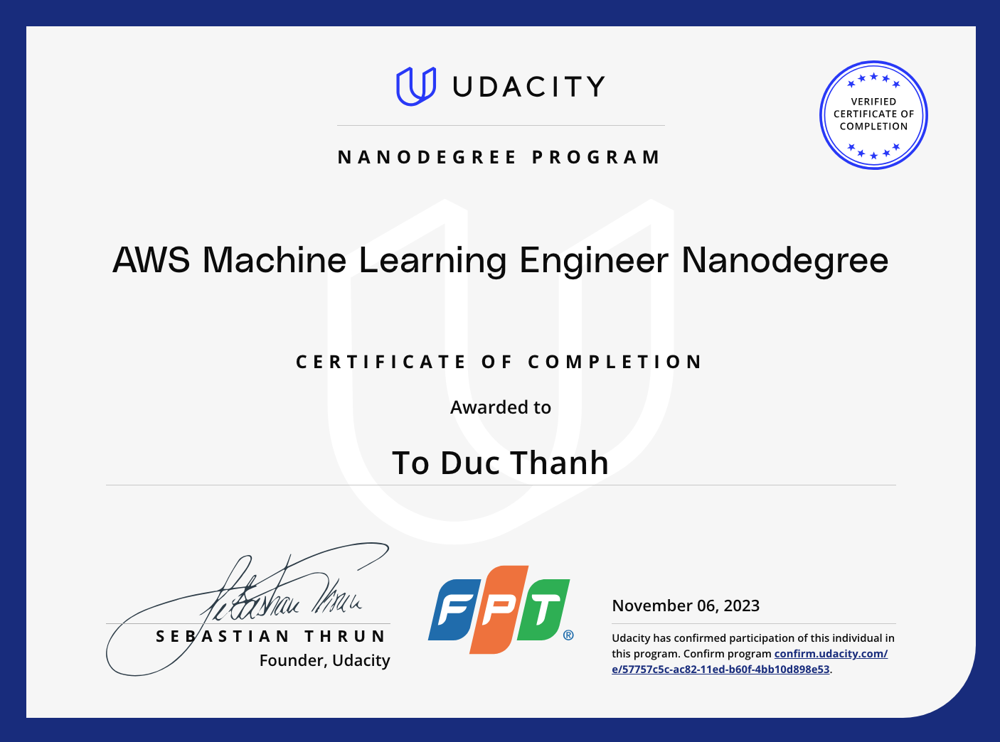

# ML-engineer-udacity
Projects done in Udacity AWS Machine Learning Engineer Nanodegree.

[Certificate](https://graduation.udacity.com/confirm/e/57757c5c-ac82-11ed-b60f-4bb10d898e53)

## Project 1: Introduction to Machine Learning

This project introduces machine learning fundamentals using AWS SageMaker. You'll:

1. Explore key concepts and their real-world applications
2. Use SageMaker Studio for initial data analysis
3. Learn the machine learning process, including:
   - Data preparation
   - Feature engineering
   - Model evaluation
   - Hyperparameter optimization
4. Develop advanced ML workflows using complex models like XGBoost and AutoGluon

Source code: [Project 1](https://github.com/ToDucThanh/ml-engineer-udacity/tree/master/Project_1)

## Project 2: Developing Your First ML Workflow

In this project, you'll learn to:

1. Utilize AWS services for model training and deployment
2. Integrate various AWS components to build a responsive ML application:
   - AWS Lambda Functions
   - AWS Step Functions
3. Combine your trained model with AWS services to create an event-driven system

Source code: [Project 2](https://github.com/ToDucThanh/ml-engineer-udacity/tree/master/Project_2)

## Project 3: Deep Learning Topics within Computer Vision & NLP

Source code: [Project 3](https://github.com/ToDucThanh/ml-engineer-udacity/tree/master/Project_3)

## Project 4: Operationalizing Machine Learning on SageMaker

This course explores sophisticated techniques for deploying machine learning projects on SageMaker, including:

1. Optimization Strategies:
   - Maximizing output
   - Reducing costs
2. High-Performance Deployment:
   - Handling high-traffic scenarios
   - Managing large-scale datasets
3. Security Considerations:
   - Best practices for securing ML applications on AWS
  
Source code: [Project 4](https://github.com/ToDucThanh/ml-engineer-udacity/tree/master/Project_4)

## Capstone Project: Build Your Own Machine Learning Portfolio

### Heart disease classification

Source code: [Capstone project](https://github.com/ToDucThanh/ml-engineer-udacity/tree/master/Capstone_project)
